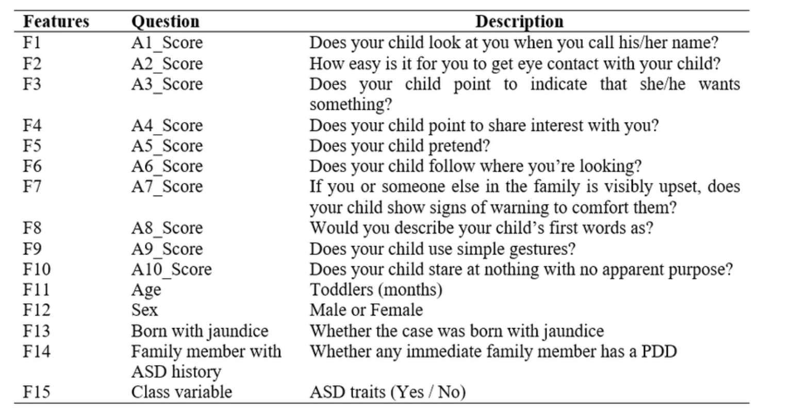
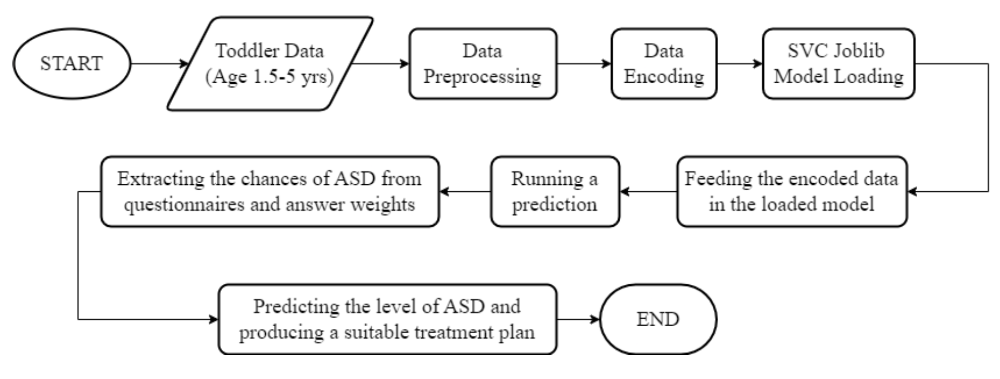

# AI-Enhanced Diagnosis of ASD Using SVC: A Data-Driven Approach
Autism Spectrum Disorder (ASD) is a complex developmental condition marked by persistent challenges in social interaction, communication, and restrictive, repetitive
behaviors. These challenges can significantly impact various aspects of an individual's life, including education, employment, and social relationships. Early diagnosis and
intervention are crucial, as they can greatly improve long-term outcomes for children with ASD. In this project, we present a novel application designed to assist in the early detection and diagnosis of ASD in children aged 1.5 to 5 years. Our app leverages a Support Vector Classifier (SVC) model trained on relevant data to assess the likelihood and typicalness of ASD. The user-friendly interface allows parents and healthcare providers to input necessary data, which the SVC model analyzes to provide a preliminary diagnosis. Furthermore, based on the model's assessment, the app recommends a customized level of therapy for the child, promoting early intervention and personalized treatment plans.

## Problem Statement
The early and accurate detection of ASD is crucial for effective intervention and support. Traditional diagnostic methods often rely on extensive behavioral assessments, which can be time-consuming and require specialized expertise. In recent years, machine learning techniques have shown promise in improving diagnostic accuracy and efficiency. This research aims to develop a robust predictive model for ASD detection using the Support Vector Classification (SVC) algorithm. By leveraging a comprehensive dataset that includes real and augmented samples collected from sources such as Kaggle, the CDC Autism Data Visualization Tool, and the University of Cambridge, this study seeks to identify key
behavioral and demographic features that contribute to ASD diagnosis. Additionally, the study will employ Recursive Feature Elimination (RFE) to optimize feature selection,
thereby enhancing the model's performance and reducing computational complexity. The primary objectives of this research are to evaluate the effectiveness of the SVC algorithm in ASD detection, to determine the most significant predictive features, and to compare the SVC model's performance against other machine learning approaches such as Artificial Neural Networks (ANN) and Random Forest (RF).

### Q-CHAT 10 Questions as per University of Cambridge

## SVC (Support Vector Classifier)
Before we go forward it is very essential to know what SVC means and its utility in the Machine Learning field. 
Support Vector Classification (SVC) is a supervised machine learning algorithm used for
classification tasks. It works by finding the optimal hyperplane that best separates data
points of different classes with the maximum margin. This hyperplane is influenced by
support vectors, which are the closest data points to the hyperplane from each class. By
maximizing the margin, SVC improves generalization to unseen data. Additionally, SVC
can handle non-linear classification problems using the kernel trick, which transforms the
input space into higher dimensions where a linear separator can be found, making it a
versatile and powerful tool for various classification problems.

Support Vector Classification (SVC) is often favored over Logistic Regression, Random Forest, and Gradient Boosting due to its capability to manage high-dimensional, complex datasets and non-linear relationships using the kernel trick. SVC excels at maximizing the margin between classes, which enhances generalization to unseen data. While Logistic Regression is highly interpretable, it is inherently linear and less effective in high-dimensional spaces without feature engineering. Random Forests can handle non-linearity and provide feature importance, but they may become computationally intensive and less interpretable with many features. Gradient Boosting is powerful for non-linear problems but requires extensive tuning and can overfit if not properly regularized.

Therefore, SVC's robust handling of high-dimensional data and non-linear decision boundaries, coupled with its robustness and impressive accuracy scores of 95.986% in training and 93.439% in validation, makes it a strong choice for many classification tasks.

Learn more from sources:
1. [Analytics Vidhya](https://www.analyticsvidhya.com/blog/2021/06/support-vector-machine-better-understanding/)
2. [scikit-learn](https://scikit-learn.org/stable/modules/generated/sklearn.svm.SVC.html)
3. [Medium](https://towardsdatascience.com/diving-into-c-support-vector-classification-221ced32e4b4)

## Workflow

### Dataset
Custom model prepared from multiple data sources. The dataset is kept private becuaase it has been prepared from multiple sources and normalised according to our need. If required please contact.
### Model Training and Exporting
The dataset, formatted as a CSV file, is loaded and cleaned by addressing data type formats and empty values. Boolean values (i.e., 'Yes' and 'No') are converted to binary (0/1) format, and consistent data entries are removed from the dataset. The corrected, cleaned, and encoded data is then fed into the classifiers previously mentioned: Random Forest, Gradient Boosting, Logistic Regression, and SVC. The accuracy levels of these classifiers are compared with varying hyperparameters. The SVC classifier has demonstrated exceptional performance, achieving an accuracy of 95.986% in training and 93.439% in validation, as shown in Table mentioned below which mentions the best 2 of the considerations. Based on the dataset analysis, Logistic Regression showed poor performance, resulting in the selection of SVC without any kernel for the final model.

### Data capturing
The data is captured from users, who can be the child's parent, paediatrician, or any relative, and includes features F1-F14 as shown in aforementioned figure, which are obtained through the application interface. The data entered, initially in string format, is appended to a list. The questionnaire responses are then converted to binary values (1) based on the following criteria: for Questions 1-9, responses with options 3-5 are assigned a value of 1, and for Question 10, responses with options 1-3 are assigned a value of 1. The responses to each question carry a weight that determines the importance of the question in assessing ASD. This weighted scoring helps in applying an overlay to determine the ASD level, as indicated in Table below. This assessment will further aid in evaluating the appropriate treatment for the child.

### Data Preprocessing and Encoding
The input data undergoes processing in accordance with the standard Scalar format. Categorical 'yes' and 'no' responses are transformed into numerical values, with 'yes' converted to 1 and 'no' converted to 0. Additionally, columns that contain 'object' data types are encoded using the LabelEncoder() function from the sklearn.preprocessing library. The process of evaluating the level of ASD is derived from and based on the data presented in Table above, as described below:
1. Assign Scores to Responses:
   - For each question, assign 1 point if the response indicates a potential ASD trait (based on the criteria provided earlier).
2. Calculate Total Score:
   - Sum the scores from all questions.
4. Convert Score to Percentage:
   - Calculate the percentage of ASD likelihood by dividing the total score by the maximum possible score (73) and then multiplying by 100.
5. Determine ASD Level:
   - Mild ASD: 0% - 33%
   - Moderate ASD: 34% - 66%
   - Severe ASD: 67% - 100%
#### Example calculation
Assume the responses indicate the following potential ASD traits:
  - Questions 1-9: 5 questions answered with options indicating ASD traits.
  - Question 10: Answered with an option indicating an ASD trait.
  This would give a _total score of 6_.
**Step-by-Step Calculation**:
  1. Total Score: 6
  2. ASD Percentage: 6/73 × 100 = 8.22%
  3. ASD Level: 8.22% falls into the Mild ASD category.
